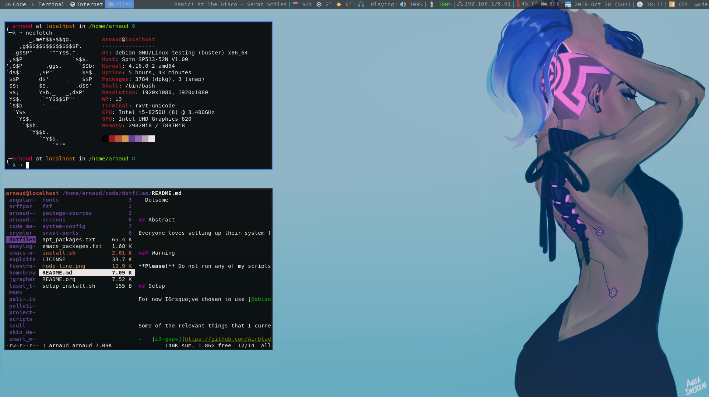
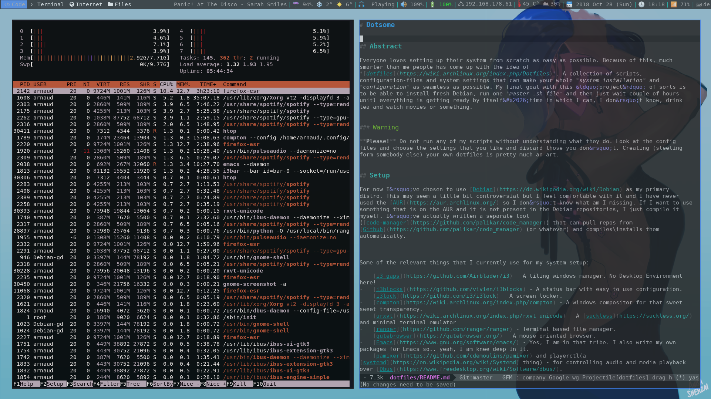

# Dotsome


## Abstract

Everyone loves setting up their system from scratch as easy as possible. Because of this, much smarter than me people has come up with the idea of *[dotfiles](https://wiki.archlinux.org/index.php/Dotfiles)*. A collection of scripts, configuration-files and system settings that can make your whole *system installation* and *configuration* as seamless as possible. My final goal with this &ldquo;project&rdquo; of sorts is to be able to install fresh Debian, run one *master .sh file* and then just wait couple of hours unitl everything is getting ready by itself&#x2026;time in which I can, I don&rsquo;t know, drink tea and watch movies or something.


### Warning

**Please!** Do not run any of my scripts without understanding what they do. Look at the config files and choose the settings that you like and discard those you don&rsquo;t. Creating (steeling form somebody else) your own dotfiles is pretty much an art.


## Setup

For now I&rsquo;ve chosen to use [Debian](https://de.wikipedia.org/wiki/Debian) as my primary distro. This may seem a little bit controversial but I feel comfortable with it and I have never used the [AUR](https://aur.archlinux.org/) so I don&rsquo;t know what am I missing. If I want to use something that is on the AUR and it is not present in the Debian repositories, I just compile it myself. I&rsquo;ve actually written a separate tool ([code-manager](https://github.com/palikar/code_manager)) that can pull repos from [Github](https://github.com/palikar/code_manager) (or whatever) and compiles\installs them automatically.


Some of the relevant things that I currently use for my system setup:

-   [i3-gaps](https://github.com/Airblader/i3) - A tiling windows manager. No Desktop Environment here!
-   [i3blocks](https://github.com/vivien/i3blocks) - A status bar with easy to use configuration.
-   [i3lock](https://github.com/i3/i3lock) - A screen locker.
-   [compton](https://wiki.archlinux.org/index.php/compton) - A windows compositor for that sweet sweet transparency.
-   [urxvt](https://wiki.archlinux.org/index.php/rxvt-unicode) - A [suckless](https://suckless.org/) and minimal terminal emulator
-   [ranger](https://github.com/ranger/ranger) - Terminal based file manager.
-   [rofi](https://github.com/DaveDavenport/rofi) - An application launcher.
-   [qutebrowser](https://qutebrowser.org/) - A mouse oriented browser.
-   [Emacs](https://www.gnu.org/software/emacs/) - Yes, I am in that tribe. I also write my own packages for Emacs so.. yeah, I am knee deep in it.
-   [pamixer](https://github.com/cdemoulins/pamixer) and playerctl(a [systemd](https://en.wikipedia.org/wiki/Systemd) thing) - for controlling audio and media playback over [Dbus](https://www.freedesktop.org/wiki/Software/dbus/).
-   [dunst](https://wiki.archlinux.org/index.php/Dunst) - a lightweight notification-daemon.


All of those (and a few more) things add up to create a comfy environment where everything is setup to my tastes, I can preform almost any action through the keyboard and I can be much more productive than when I am using Windows or some DE ([Desktop Environment](https://en.wikipedia.org/wiki/Desktop_environment)). A few screenshot for visual representation of my system:






## Installation

*Note:* As said, I use Debian and my dotfiles and system setup <span class="underline">will probably work only</span> on it as I have a few Debian specific things. Use the dotfiles on other systems at your own risk!


There are a few ways to download the setup the whole thing. If your system is fully fresh and you don&rsquo;t even have *git* on your system, you can run:

```sh
curl -LOs https://gist.githubusercontent.com/palikar/02e1d0e3c14e63bdf80a12d484ce9f46/raw/c5e0851bd814bc5ebbe89da8a60b8d59e9825cfb/install_setup.sh
sudo bash install_setup.sh
```

This is [this](https://gist.github.com/palikar/7e520697033d3dfd9825e5207230d070) gist of mines. Of course this relies on [curl](https://curl.haxx.se/).


If you, however, already have *git*, you can just clone the repo and run the `install.sh` script. My recommended way of doing that is.

    cd ~
    mkdir code && cd code
    git clone https://github.com/palikar/dotfiles
    cd dotfiles
    sudo bash setup_all.sh

This &ldquo;should&rdquo; setup almost everything. I keep all of my configuration files in the directory of the repository and just create symbolic links at the right places. This way I have quite the separation between the used system and all of the configuration for it.


## Relevant files

As you may see, I have quite a lot of files that I use for my system. I don&rsquo;t have the time to go over each of them but I can present some short explanations on some of them.


### Basic system config

A list of somewhat important configuration files:

-   `.emacs` - init file for Emacs. Doesn&rsquo;t do that much on its own. The file loads a separate configuration file for Emacs written in [org-mode](https://orgmode.org/) &#x2013; [myinit.org](./.emacs.d/myinit.md)
-   `.vimrc` - very basic vim configuration. I took it form &ldquo;the internet&rdquo;.
-   `.Xdefaults` - sets up the colors and XResources for the XSession and it&rsquo;s used by urxvt as a config file.
-   `.paths` - every line here must be directory. The directories in the file will be added to your *PATH* automatically.
-   `emacs_packages.txt` - A list of emacs packages that I want installed and present in my Emacs. The file is used by a script that updates the file and the an Emacs configuration file so that every time I launch Emacs, all of the packages will be checked. I something is not installed, it gets installed automatically.
-   `apt_packages.txt` - A list of apt packages that I want to have on my system. The packages will be installed upon system setup by the `install.sh` script.
-   `system-config/.bash_aliases` - some useful abbriviations for certain commands in the terminal
-   `system-config/.bash_prompt`
-   `system-config/.env` - setting up some basic environment variables
-   `system-config/.bashr` - this file will be evaluated every time you launch *bash*.
-   `system-config/.profile` - the file will be evaluated upon starting the session.
-   `system-config/.inputrc` - some minor fixes for better typing in the terminal
-   `.gitconfig` - making `git` more pleasant to work with. Mainly diffetent abbreviations for git-commands. Also sets up my email-address for git commits. This is important! Change the address if you are going to use the file.

The important &ldquo;linux&rdquo; files are in folder <system-config>.


### Applications config

The folder <fzf> contains couple of bash scripts that will be sourced by `.bashrc`. [Fzf](https://github.com/junegunn/fzf) is a command-line fuzzy finder and it provides some useful features for those of us that spend a lot of time looking at the terminal. The command that I regularly use are:

| Keybinding | Command                                                                                                                            |
|---------- |---------------------------------------------------------------------------------------------------------------------------------- |
| `Alt-c`    | Fuzzy change directory. It will recursively find all directories<br>from the current one onward and it will prompt you choose one. |
| `C-r`      | Fuzzy search for previous command. List all commands in the bash history and choose one                                            |
| `C-t`      | Fuzzy select file. List all files in the subdirectories and prompts you to choose one.                                             |


On Linux a lot of applications create their own folders with configuration files and those are usually created in the `~/.config` folder. I don&rsquo;t care about all of the applications&rsquo; configurations on my system so I don&rsquo;t version control the whole `~/.config` folder but rather only parts of it. Some of the more important things in there are:

-   `code_manager/` - configuration files, cache and install scripts for a tool for package management that I&rsquo;ve written in python. For more information, check out [the repository](https://github.com/palikar/code_manager).
-   `compton/` - configuration files of Compton.
-   `dunst/` - Dunst configuration that makes the notifications that pop up somewhat pretty
-   `feh/` - [feh](https://feh.finalrewind.org/) is an image viewer that I use for&#x2026; setting my background (no joke). And yeah, I also use if as image viewer sometimes so I need some basic keybindings.
-   `gitk/` [gitk](https://git-scm.com/docs/gitk) is a Git repository browser. Very convenient
-   `i3/` - This contains probably the most important configuration file for my system &#x2013; the configuration for the windows manager.
-   `i3blocks/` - again a single configuration file that specifies how the status bar of the system should look like. The configuration uses a lot of the scripts in `.scripts/` directory.
-   `khal/` - [khal](https://github.com/pimutils/khal) is a CLI calendar application.
-   `ranger/` - the configuration files of my file manager
-   `qutebrowser/` - the configuration files of my file browser
-   `rofir/` - configuration mainly to &ldquo;prettify&rdquo; rofi

2


### Auxiliary scripts

The folder <.scripts> contains&#x2026; a lot of stuff. There I put scripts needed by some part of the system. The folder is in the path so everything can be easily executed on command line. There are a lot of scripts in there and a lot of them are self-explanatory. For sake of completeness though&#x2026;:

-   `battle` - opens a bunch of stuff that I found myself opening manually when I sit on my computer.
-   `i3battery` - used by i3blocks to display battery information of a laptop
-   `i3calendar` - used by i3blocks for the current date
-   `i3cputemp` - used by i3blocks for some processor information
-   `i3currentson` - used by i3blocks to display the currently played by Spotify song
-   `i3ipadress` - used by i3blocks to display your local IP address
-   `i3playerctrl` - used by i3blocks to display the status of the media player
-   `i3ramusage` - used by i3blocks to display info about the RAM
-   `i3resize` - used by i3-gaps to intuitively resize windows
-   `i3spotifyupdate` - used as a daemon to gather information coming from Spotify and notify i3blocks
-   `i3systeminfo` - used by i3blocks to bring together RAM and CPU info
-   `i3volume` - used by i3blocks to display the current volume
-   `i3weather` - used by i3blocks to display the current weather information
-   `i3wifi` - used by i3blocks to display the current wifi status
-   `i3xautolock` - used as daemon to lock the computer after certain amount of inactivity
-   `lmc` - used by i3blocks control median and sound
-   `lockscreen` - used by i3-gaps to lock the computer
-   `networkmanager_dmenu` - used to easy manage network connections. Check out [here](https://github.com/firecat53/networkmanager-dmenu).
-   `pathloader` - used by `.profile` to load paths from `.paths`
-   `prompt` - used by i3-gaps as a generic way to prompt something by dmenu.
-   `rofi-xrandr` - used for easily configuring two displays. Uses [xrandr](https://wiki.archlinux.org/index.php/xrandr).
-   `samedir` - opens a new terminal in the same directory as the current one
-   `setupxkbd` - sets up keyboard layout things
-   `shortcuts` - sets up shortcuts for bash (in form of aliases), qutebrowser and ranger. Full credit goes to [Luke Smith](https://github.com/LukeSmithxyz/voidrice).
-   `texclear` - deletes all files generated when compiling a *.tex* file
-   `toggletouchpad` - disables the touchpad on a laptop
-   `unix` - Find out yourself. This is&#x2026; not for normies.
-   `updateaptpack` - Updates `emacs_packages.txt` with the currently installed by Emacs packages
-   `updateemacspack` - Updates `apt_packages.txt` with the currently installed packages on the system.


### Emacs

I&rsquo;ve been using EMACS for a while now. Before my config was just a random snippets of code that I&rsquo;ve found online. Now, it&rsquo;s beautifully sorted random snippets of code that I&rsquo;ve found online, all put together nicely on a formatted `.org` file. The `.emacs` file is there just to load [myinin.org](./.emacs.d/myinit.md). There, in literate programming style, is my actual *init* file. There are even some explanations around some of the the snippets and everything is categorized. If you use Emacs you can open the file and experience it in all it&rsquo;s beauty. The whole Emacs configuration probably deserves its own repository but oh well. More information on the Emacs config &#x2013; [EMACS.md](./.emacs.d/EMACS.md) . This is actually the configuration itself but exported to markdown file


### Package sources

For my Debian system I use diffetent sources for the apt-packages from those the come with the system. My `sources.list` files are in the *package-sources* directory of the repository. Upon installation of the dot files hey&#x2026;.the are still nice.


## References

For my dotfiles I&rsquo;ve extensively taken inspiration from:

-   [Mathias Bynens](https://mathiasbynens.be/) and his [dotfile](https://github.com/mathiasbynens/dotfiles)
-   [This](https://medium.com/@webprolific/getting-started-with-dotfiles-43c3602fd789) very good post on starting up with dotfiles
-   Recently I&rsquo;ve changed my Bash Prompt and made it pretty much like this [guy&rsquo;s(KeizerDev)](https://github.com/KeizerDev/.bashrc) one.
-   <span class="underline">A LOT</span> of the scripts were first taken form [Luke Smith&rsquo;s](http://lukesmith.xyz/) [voidrice](https://github.com/LukeSmithxyz/voidrice). Also, go check out this [Youtube&rsquo;s channel](https://www.youtube.com/c/lukesmithxyz) for some non-normie content.
